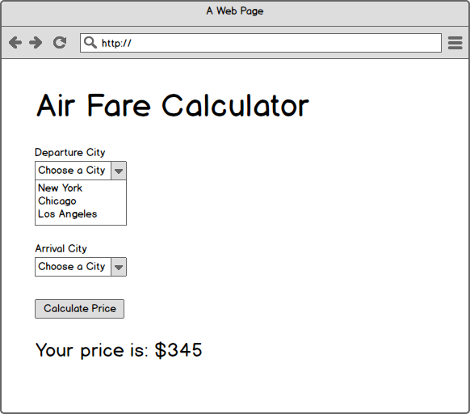
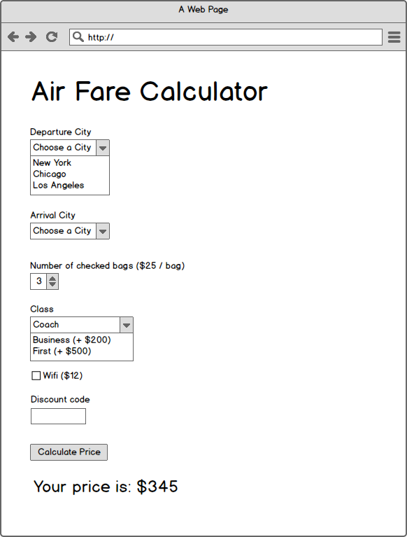

# Air Travel Calculator

1. Fork, clone and open the project
1. Create a standard HTML project files / folders:
  * index.html
  * css
    * app.css
  * js
    * logic.js
    * app.js
1. Commit and push / submit a pull request
1. Work through the stories
  - commit and push after completing each story
1. Validate your HTML
1. Deploy to S3
1. Enter your URL in the project in http://students.galvanize.com

NOTE: put all logic functions in `logic.js` and put all DOM manipulation / event logic in `app.js`.

## Stories

**Users can calculate the price between two cities**

    When a user clicks the "Calculate Price" button
    Then the correct price should appear beneath the controls

The prices are:

    Chicago -> Chicago:         $0
    Chicago -> Los Angeles:     $350
    Chicago -> New York:        $250

    Los Angeles -> Chicago:     $350
    Los Angeles -> Los Angeles: $0
    Los Angeles -> New York:    $545

    New York -> Chicago:        $250
    New York -> Los Angeles:    $545
    New York -> New York:       $0

**Users can calculate the price with checked bag**

    When a user fills in the number of checked bags
    And clicks the Calculate Price button
    Then the calculated price should increase by $25 / bag

    NOTE: if the user enters a negative number,
    the price should NOT go down

**Users can calculate the price with an upgrade**

    When a user selects the class (Business or First)
    And clicks the Calculate Price button
    Then the displayed price should increase by the specified amount

**Users can calculate the price with WiFi**

    When a user checks the WiFi checkbox
    And clicks the Calculate Price button
    Then the displayed price should increase by $12

**Users can enter discount codes**

    When a user enters the discount code 10OFF
    And clicks the Calculate Price button
    Then the base price (city-to-city) should be reduced by 10%

    When a user enters the discount code 20OFF
    And clicks the Calculate Price button
    Then the base price (city-to-city) should be reduced by 20%
